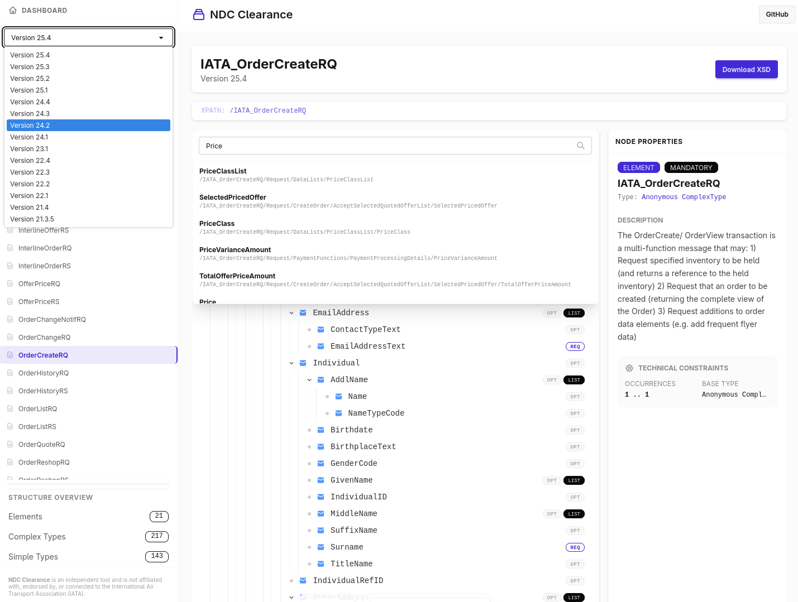

# NDC Clearance

**Live Version: [ndc-clearance.netlify.app](https://ndc-clearance.netlify.app)**

NDC Clearance is an interactive explorer for IATA NDC (New Distribution Capability) schemas.



## Why this project?

This project was created to address several challenges with standard NDC distributions:

1.  **LLM-Friendly Schemas**: Standard NDC messages are typically split into a small message file and a massive common file containing thousands of types, the majority of which are unused by any single message. This makes them difficult for Large Language Models (LLMs) to process effectively. Our tools flatten these schemas, including ONLY the types actually used by a specific message, making them compact and context-window friendly.
2.  **Improved UI/UX**: Browsing and searching complex XSD structures in a standard text editor is cumbersome. NDC Clearance provides a modern, interactive interface to visualize the hierarchical structure and perform deep searches with XPath awareness.

3.  **Open Source Accessibility**: Providing a community-driven tool to navigate the industry standards more efficiently.

## Project Structure

- `site/`: The web application built with [Astro](https://astro.build/) and [Svelte](https://svelte.dev/).
- `flatten_ndc_schemas.py`: A Python script for merging and selectively including types from referenced NDC XSD schemas to create self-contained files.
- `batch_flatten.py`: A helper script for batch processing multiple NDC messages through the flattener.
- `iata_ndc_messages.json`: Metadata and configuration detailing the NDC messages and versions supported.

## Features

- **Interactive Schema Explorer**: Visualize the hierarchical structure of NDC messages.
- **Deep Search**: Locate elements and attributes with XPath awareness.
- **LLM-Friendly Schemas**: Tools to flatten complex schemas into smaller, self-contained files suitable for context windows.
- **Multi-Version Support**: Support for various IATA NDC releases (e.g., 25.1, 25.3, 25.4).

## Getting Started

### Web Interface

1. Navigate to the `site/` directory:
   ```bash
   cd site
   ```
2. Install dependencies:
   ```bash
   npm install
   ```
3. Start the development server:
   ```bash
   npm run dev
   ```

### Schema Flattening Tools

The Python scripts in the root directory can be used to process raw NDC schemas.

```bash
python3 flatten_ndc_schemas.py --help
```

## Disclaimer

This project is an independent open-source tool and is **not affiliated with, endorsed by, or sponsored by IATA** (International Air Transport Association).

## License

AGPL

