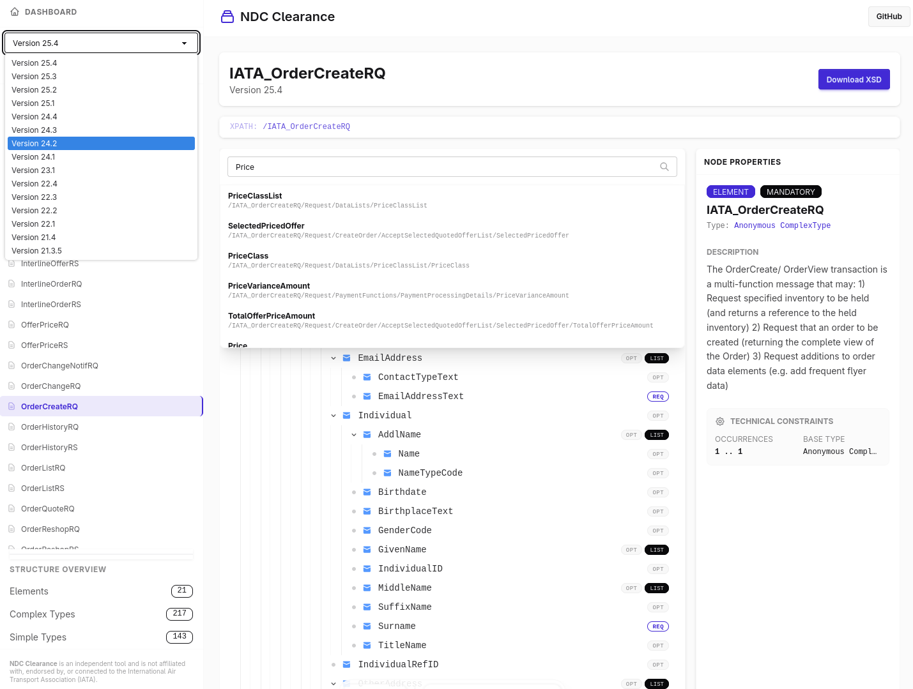

# NDC Clearance

**Live site:** [ndc-clearance.netlify.app](https://ndc-clearance.netlify.app)

**Public MCP endpoint:** `https://mcp-ndc.sunrisehikers.io/mcp/sse`

NDC Clearance is a browser, validator and diff tool for IATA NDC (New Distribution Capability) XML schemas. It supports NDC releases from **21.3.5 through 26.3**, with worked XML examples, an interactive flow viewer and an MCP server for agent integration. The exact release/message lists are registered in `iata_ndc_messages.json`; runtime availability depends on the generated schema directories.

- Browse and search schema elements, types and documentation.
- Compare releases with static, precomputed diffs and CSV export.
- Validate XML against a selected release using the backend.
- Explore IATA and custom examples alongside their message flows.
- Discover schemas, retrieve XSDs and examples, and validate XML through MCP.



## Repository layout

| Path | Purpose |
|---|---|
| `site/` | Astro + Svelte static frontend |
| `backend/` | Kotlin/Ktor validation, REST and MCP server; static diff generator |
| `tools/` | Kotlin CLI tools for ZIP import, schema flattening and content management |
| `raw_ndc_schemas/` | Original extracted IATA XSD sources |
| `ndc_schemas/` | Generated schemas, grouped by version and message |
| `ndc_diffs/` | Generated gzipped JSON comparisons for version pairs |
| `ndc_content/` | Canonical example files, source metadata, catalog and flows |
| `iata_ndc_messages.json` | Version-to-message mapping |
| `.github/workflows/` | Tooling checks and site/backend deployment |

The three subprojects have independent builds. Run commands from the indicated directory. Contributor instructions are in [AGENTS.md](AGENTS.md).

## Local development

Use the Node.js version configured in `.github/workflows/deploy-site.yml` and a JDK matching `jvmToolchain` in each Kotlin project’s `build.gradle.kts`. Set `JAVA_HOME` accordingly. Each Kotlin project supplies its own Gradle wrapper; a separate Gradle installation is unnecessary.

Dependency versions belong in `site/package.json`, `site/package-lock.json` and the Kotlin build files. Gradle versions belong in each `gradle/wrapper/gradle-wrapper.properties`. Consult those files rather than maintaining version numbers in documentation.

### Prepare schemas and diffs

Flattened schemas are committed in `ndc_schemas/`, so a checkout already includes them. Regenerate locally when importing or changing schema sources; then regenerate static diffs for the comparison viewer. From the repository root:

```bash
cd tools
./gradlew flatten
cd ../backend
./gradlew precomputeDiffs
```

Flattening uses the registered message list and available raw source directories. It skips releases without a matching raw directory; explicitly requesting a missing release fails. Commit the flattened schemas together with their raw sources and message-map changes. Static diffs and copied runtime assets remain uncommitted build artifacts.

`precomputeDiffs` reads `ndc_schemas/` and writes `ndc_diffs/diff_{from}_to_{to}.json.gz` for ascending version pairs. The browser handles reverse comparisons. This step is needed for the site's `/diff` page; the site build can finish without these files, but comparisons will be unavailable.

The canonical catalog and flows are already in the repository. Rebuild them after changing their source data, as described below; downloading from IATA is not required for local startup.

### Frontend

From the repository root:

```bash
cd site
npm ci
npm run dev
```

Open `http://localhost:4321`. Both `dev` and `build` run `copy-assets` first:

| Script | Source → destination |
|---|---|
| `copy-schemas` | `ndc_schemas/` → `site/public/schemas/` |
| `copy-content` | `ndc_content/examples/` and `ndc_content/flows/` → `site/public/content/` |
| `copy-diffs` | `ndc_diffs/` → `site/public/diffs/` |

Re-run `npm run copy-assets` after changing data while the dev server is running. XML validation uses `PUBLIC_API_URL`, defaulting to `http://localhost:8080`. MCP setup links use `PUBLIC_MCP_URL`, defaulting to the public MCP endpoint. These values are set at dev/build time, for example in an uncommitted `site/.env`.

### Backend

After generating schemas, run from the repository root:

```bash
cd backend
SCHEMA_ROOT=../ndc_schemas CONTENT_ROOT=../ndc_content ./gradlew run
```

The server listens on `http://localhost:8080`; `/` redirects to the public site. The local MCP endpoint is `http://localhost:8080/mcp/sse`.

| Environment variable | Default | Purpose |
|---|---|---|
| `PORT` | `8080` | HTTP port |
| `SCHEMA_ROOT` | `src/main/resources/schemas` | Schema directory |
| `CONTENT_ROOT` | `src/main/resources/content` | Content directory containing `examples/catalog.json` |
| `POSTHOG_API_KEY` | Unset | Optional backend analytics |

The default resource directories require a data sync, as performed by CI. The command above uses canonical local data directly. Backend schema discovery is filesystem-based, so new releases require no version-specific REST or MCP registration.

### Checks

Run each group from its subproject directory:

```bash
# site/
npm run lint
npm run check
npm run test
npm run build

# tools/
./gradlew test

# backend/ (generate schemas first)
SCHEMA_ROOT=../ndc_schemas CONTENT_ROOT=../ndc_content ./gradlew test
./gradlew shadowJar
```

Tooling schema tests read `iata_ndc_messages.json` and compile every registered message with an available raw release directory, both before and after flattening. Temporary outputs keep committed schemas unchanged. Backend catalog tests cover discovery and schema compilation for every release directory in `ndc_schemas/`, using `iata_ndc_messages.json` for expected messages. Registered releases without a schema directory are not test cases. Validation and diff behavior use controlled fixtures; example tests also exercise the canonical catalog. The canonical IATA example test reports invalid examples as non-blocking, but fails on missing schemas/files or when no example validates.

## Import an IATA schema release

1. Inspect the IATA ZIP and verify its NDC message set and transitive XSD dependencies. The package may also contain unrelated XML standards, PDFs and OpenAPI definitions.
2. Register the verified release/message list in `iata_ndc_messages.json`.
3. From `tools/`, set the release and archive path, then import and flatten:

```bash
# Replace these placeholders with the registered release and local ZIP path.
NDC_RELEASE='<registered-release>'
NDC_ARCHIVE='../<iata-release-archive>.zip'
./gradlew importSchemas --args="--version=$NDC_RELEASE --archive=\"$NDC_ARCHIVE\""
./gradlew flatten --args="--version=$NDC_RELEASE"
./gradlew test
```

The importer writes original XSDs to `raw_ndc_schemas/{version}_ndc/`, including
registered messages and their transitive dependencies. It requires each file
to be present and unambiguous, rejects conflicting existing sources, and
preserves the original bytes. It supports sibling XSD imports; paths outside
that layout are rejected. Keep source provenance alongside imported files.

`flatten` without arguments regenerates all registered releases with available
raw sources. Review and commit raw XSDs, the message map and the resulting
`ndc_schemas/{version}/` files together. Deployment workflows consume these
committed flattened schemas; they do not run flattening.

After generation, run `./gradlew precomputeDiffs` from `backend/`, then
`npm run copy-assets` from `site/`. The backend's REST/MCP discovery, validation
and diff services discover generated releases automatically. Add regression
coverage for schema compilation, XML validation and comparisons when importing
a release; a matching filename alone does not establish compatibility.

Inspect the archive separately for worked examples. Do not infer an example's
URL schema ID from a release number: add `NdcConstants` mappings only when an
actual IATA example establishes the ID. Existing examples and flows retain
their declared versions.

## Content pipeline

```text
ndc_content/
  examples/
    files/iata/                 # downloaded XML (may contain scenario subdirectories)
    files/custom/               # custom XML
    sources/iata.generated.json
    sources/custom.json
    catalog.json
  flows/
    sources/iata.generated.json # scraped IATA step metadata
    flows.json                 # merged IATA flows and custom definitions
```

Example IDs default to `ex_<12 hex characters>` derived from the SHA-256 of `source|message|version|source_page_id_or_url|file_name`; source records can also supply an explicit ID. Catalog examples have a nullable `flow_id`. Explicit flow assignments take precedence over IATA page/URL-based fallback IDs.

Flow records use `id` as the `/flows/[id]` route slug. Generated IATA slugs come from titles. Preserve existing IDs and slugs when editing titles or metadata to avoid breaking references and URLs.

### Refresh IATA examples and flows

From `tools/`:

```bash
./gradlew download
./gradlew buildContentCatalog
```

`download` fetches IATA pages and XML, updating both example and flow source metadata. `buildContentCatalog` writes `examples/catalog.json` and rewrites `flows/flows.json`, regenerating flows with `status: "iata"` and preserving custom flows. It checks existing flow references, example/message consistency, duplicate IDs and conflicting example assignments. Custom flows override generated flows with the same ID.

The merge drops nonempty flows unless every step has an `example_id`. Coverage here means example association, not successful XML validation. Review both output files after rebuilding; they are tracked canonical data consumed by the site/backend, unlike copied runtime assets.

### Add custom examples or flows

1. Put XML under `ndc_content/examples/files/custom/` and add its metadata to `examples/sources/custom.json`.
2. Add or update custom records in `ndc_content/flows/flows.json`, using `status: "custom"`, stable `id`/`step_id` values, and matching `message`/`example_id` pairs. Every step needs an example to survive the merge.
3. Run `./gradlew buildContentCatalog` from `tools/`, then review the catalog and merged flows.
4. Run `npm run copy-assets` from `site/` to refresh browser assets.

Additional commands, run from `tools/`:

| Command | Purpose |
|---|---|
| `./gradlew validate` | Validate downloaded IATA XML against flattened schemas |
| `./gradlew validate --args='--schema-type=raw'` | Validate against raw schemas |
| `./gradlew analyzeMissing` | Compare message definitions with example coverage |
| `./gradlew validateFlows` | Check flow message names against the baseline schema set selected in `ValidateFlows.kt` |
| `./gradlew verifyFlowCoverage` | Check that every flow step has a nonempty example ID |

The two standalone flow checks are not invoked by `buildContentCatalog`. The worked-example validator uses URL schema-ID mappings in `NdcConstants.kt`; an unmapped ID is reported as missing coverage, and its exit code alone does not guarantee every file was validated.

## REST and MCP

| Method | REST path | Purpose |
|---|---|---|
| GET | `/` | Redirect to the public site |
| GET | `/schemas` | List versions and message names |
| POST | `/validate` | Validate a JSON body containing `version`, `message`, `xml` |
| GET | `/api/diff?from=<version>&to=<version>` | Compute a version comparison |

Use message names without `IATA_` for schema lookup, such as `AirShoppingRQ`. The site's diff viewer reads static files rather than calling `/api/diff`.

Available MCP tools at `/mcp/sse`:

- `validate_ndc_xml`
- `list_versions`
- `list_schemas` (optional `version`)
- `get_schema_files`
- `list_examples` (optional `message`, `version`; no filters returns all active examples)
- `get_example_content` (required `example_id`; optional `include_metadata`, default `true`)

Example retrieval is available through MCP and the site's static content. There are no REST example/flow endpoints or dedicated MCP flow tools; the interactive flow viewer is part of the site.

## CI and deployment

All workflows use path filters and run on pushes to `main`; tooling checks also run on matching pull requests.

- `ci-tools.yml`: run tooling tests and rebuild the canonical catalog.
- `deploy-site.yml`: use committed schemas to precompute diffs, install dependencies, lint/test/build the site, and deploy to Netlify. Its toolchain is configured in the workflow.
- `deploy-backend.yml`: sync committed schemas/content, run backend tests, build the JAR, and deploy to Unikraft Cloud with the configured Java toolchain.

The site deployment sets `PUBLIC_API_URL=https://mcp-ndc.sunrisehikers.io`. Changes to committed flattened schemas trigger both deployments. Raw schema and tooling changes run tooling checks; regenerate and include flattened outputs when those changes affect deployed schemas. See the workflow files for the complete filters and required secrets. Keep secrets and `.env` files out of Git.

## Docker Compose status

`docker-compose.yml` defines a site on port 4321 and a backend on port 8080, but the current Dockerfiles do not provide a complete fresh-checkout setup:

- The site image copies schemas but omits `ndc_content/` and `ndc_diffs/`; its current asset-copy step requires content and cannot build successfully without it.
- The backend image requires schemas synced into `backend/src/main/resources/schemas/` before building. It does not copy content into a runtime filesystem directory or configure `CONTENT_ROOT`; Compose also lacks a content mount.

Use the local commands above for the complete application. These container data-copy gaps need addressing before relying on `docker compose up --build` for examples, flows and comparisons.

## Disclaimer

This project is independent and is not affiliated with, endorsed by, or sponsored by IATA.

## License

[GNU Affero General Public License](LICENSE).
